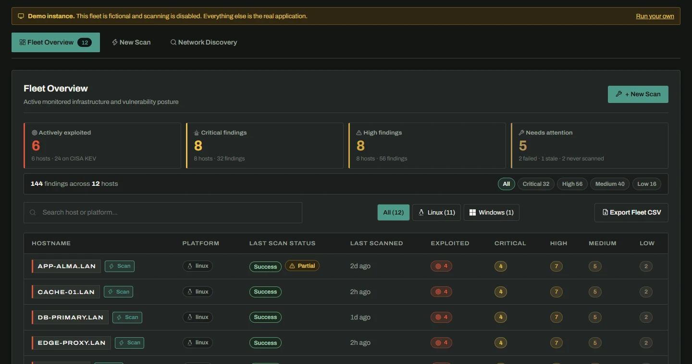
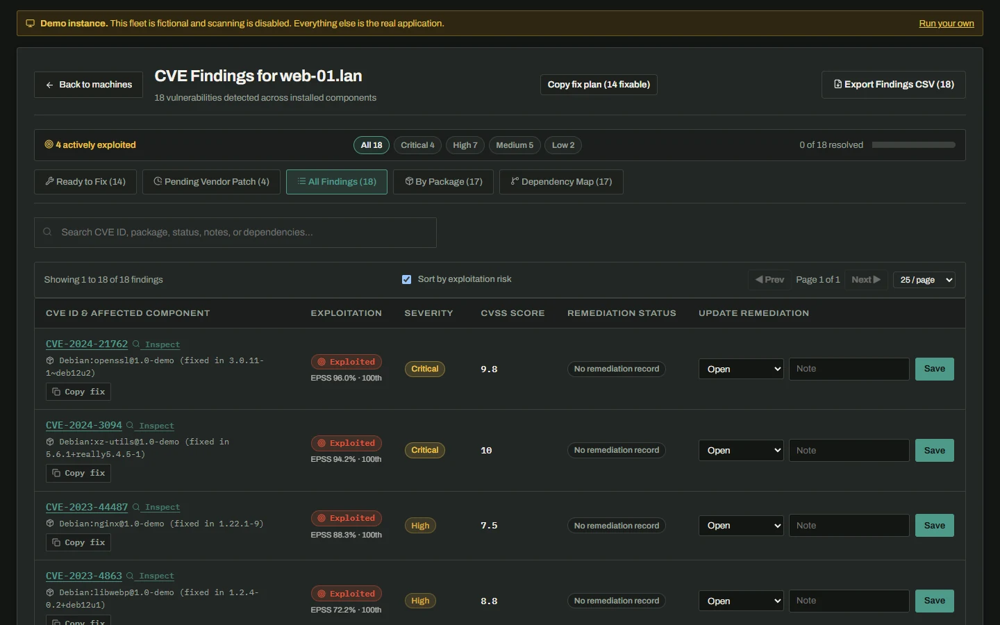

<p align="center">
  <picture>
    <source media="(prefers-color-scheme: dark)" srcset="docs/assets/logo-dark.svg">
    
  </picture>
</p>

<p align="center">
  <strong>Agentless CVE scanning and fleet remediation for Linux hosts, over SSH.</strong><br>
  Findings are ranked by what is being exploited, not just by what scores highest.
</p>

<p align="center">
  <a href="https://github.com/reprodev/cvedeck/actions/workflows/ci.yml"></a>
  <a href="LICENSE"></a>
  <a href="https://github.com/reprodev/cvedeck/pkgs/container/cvedeck"></a>
</p>

<p align="center">
  <a href="#quick-start">Quick start</a> ·
  <a href="#try-it-with-demo-data">Demo</a> ·
  <a href="#what-it-does">Features</a> ·
  <a href="DEPLOYMENT.md">Deployment</a> ·
  <a href="docs/SCANNING_PROVENANCE_AND_METHODOLOGY.md">Methodology</a> ·
  <a href="docs/DEVELOPMENT_STORY.md">Development story</a>
</p>

<p align="center">
  <picture>
    <source media="(prefers-color-scheme: light)" srcset="docs/assets/fleet-light.webp">
    
  </picture>
</p>

---

A central server scans your Linux machines over SSH, with nothing installed on
them. It matches what it collects against public vulnerability data (OSV.dev for
package advisories, plus NVD for OS-level CVEs if you turn it on) and marks every
finding with real-world exploitation data from CISA KEV and FIRST EPSS. Results
go in a local database, with optional sync to a remote one, and are shown on a
web dashboard. A JSON API lets other tools pull the same data.

**Why the exploitation data matters.** A fleet of thirty hosts routinely
produces several hundred High and Critical findings. Sorted by CVSS alone, that
list gives you no way to find the three that matter this week. CVSS says how bad
a vulnerability would be *if* exploited; KEV says whether it is being exploited
right now; EPSS says how likely that is to start. CveDeck ranks by all three.

Everything is manual for now: no scheduled scans, and no automated remediation.

> [!NOTE]
> **Windows is not supported yet, and CveDeck says so rather than guessing.**
> Windows hosts can be discovered and added to the fleet, and inventory can be
> collected over WinRM, but CveDeck cannot yet match Windows software or
> cumulative updates against vulnerability data. A Windows scan would finish with
> no findings, which looks exactly like a clean host, so Windows scans are refused
> with that reason instead. See the
> [Windows research tracks](docs/SCANNING_PROVENANCE_AND_METHODOLOGY.md#9-target-architecture-roadmap-linux-first-execution--windows-research-tracks).

## What it does

- **Signs you in.** Login is built in and on from the first start, with no
  default password: a one-time setup code in the container log creates the
  account. Scripts use API tokens you create and revoke in Settings.

- **Scans without agents.** SSH (`paramiko`), with a password or an
  Ed25519/ECDSA/RSA key that is parsed in memory and never written to disk. A
  pre-flight connection test reports reachability, credentials and the OS banner
  before you commit to a scan. Each host's SSH key is pinned on first contact,
  and a host whose key changes is refused before it sees a credential.

- **Shows what changed since the last scan.** Every scan is kept with the
  findings it found new and the ones it cleared, and each finding shows when it
  first appeared. A scan that could not reach an advisory source never counts a
  finding as resolved.

- **Ranks by exploitation, not just severity.** Every finding shows whether CISA
  lists it as actively exploited (with the federal remediation due date), and
  FIRST's modelled probability of exploitation in the next 30 days, with its
  percentile. The default order is KEV, then EPSS, then CVSS. Both feeds are
  cached locally and joined offline: one download a day, not one API call per
  finding.

- **Says when it does not know.** A finding that hasn't been checked against KEV
  shows as *unknown*, never as *not exploited*. If the feeds have never loaded or
  have gone stale, the dashboard says so, and `GET /api/feeds` reports each feed's
  age, record count and staleness. A scan that ran while an advisory source was
  unreachable is marked partial rather than clean, and a host that was enrolled
  but never scanned says exactly that.

- **Covers the distributions people actually run.** Debian, Ubuntu, Raspbian,
  RHEL, CentOS, AlmaLinux, Rocky, Oracle, Amazon Linux, Fedora, Alpine, Arch,
  openSUSE, SLES, Wolfi and Chainguard, through a five-tier resolution pipeline. A
  distribution without its own OSV tracker resolves onto the upstream it derives
  from; an unrecognised one queries every canonical ecosystem rather than
  guessing. The running kernel and pending-reboot state are collected too, so a
  fully patched host still running the kernel it booted from isn't reported as
  clean.

- **Tells you what you can actually fix.** Findings are split into those with a
  vendor patch available in the host's repositories, those awaiting an upstream
  build, and those cleared on a re-scan. For the first group it generates the
  upgrade command for that host's own package manager (`apt`, `dnf`, `apk`,
  `pacman`, `zypper`), plus a bulk script for every fixable package. Commands are
  for you to review; CveDeck never runs anything on a target.

- **Shows what a removal would break.** A dependency explorer tells a package
  that eleven applications require apart from a standalone leaf you can safely
  purge, so remediation doesn't take a service down with it.

- **Finds hosts you forgot about.** Subnet sweeps over ICMP, TCP connect, and
  unauthenticated SSH/HTTP/SMB banner reads, with one-click enrollment. No
  credentials are sent during discovery.

- **Gets out of the way.** Drill-down with CVSS gauges and links to NVD, the
  Ubuntu Security Tracker and OSV.dev; tabbed workspaces; severity and platform
  filters; pagination; light, dark and system themes; a linkable URL for every
  screen; and RFC 4180 CSV export for the fleet, a host's findings, or a discovery
  sweep. Remediation status and notes are stored locally, with optional sync to a
  remote database.

<p align="center">
  <picture>
    <source media="(prefers-color-scheme: light)" srcset="docs/assets/host-light.webp">
    
  </picture>
</p>

## Quick start

The application ships as one container image that serves the API and the
dashboard on a single port, with the database in a directory you mount. No
checkout needed:

```bash
docker run -d --name cvedeck -p 3325:8000 -v /srv/cvedeck:/data ghcr.io/reprodev/cvedeck:latest
```

Then open <http://localhost:3325>. The first time, it asks for a setup code to
create your account. Find it in the log:

```bash
docker logs cvedeck
```

To create the account from configuration instead, see
[Authentication](DEPLOYMENT.md#authentication).

<details>
<summary><strong>Or with Docker Compose</strong></summary>

Save this as `docker-compose.yml` and run `docker compose up -d`:

```yaml
services:
  cvedeck:
    image: ghcr.io/reprodev/cvedeck:latest
    container_name: cvedeck
    restart: unless-stopped
    ports:
      - "3325:8000"
    volumes:
      # The database lives here. Back this directory up.
      - ./data:/data
    environment:
      PUID: "1000"
      PGID: "1000"
      TZ: "UTC"
```

</details>

> [!WARNING]
> Login keeps strangers out, but over plain HTTP the password, the session and
> the SSH credentials you scan with all cross the network readable. Put a TLS
> reverse proxy in front before exposing CveDeck beyond a network you trust. See
> [DEPLOYMENT.md](DEPLOYMENT.md#security).

### Try it with demo data

An empty dashboard says very little. To see a populated fleet without enrolling
any hosts:

```bash
docker run -d -p 3325:8000 -e CVEDECK_DEMO_MODE=true ghcr.io/reprodev/cvedeck:latest
```

This seeds a fictional twelve-host fleet, including a host that has never been
scanned, one whose credentials failed, one scanned while an advisory source was
down, and findings whose exploitation status was never checked. It also
**disables scanning, discovery and connection tests**. The threat-intel feeds
start empty, so press **Refresh intel** to download them and see the ranking in
the screenshots above. Demo mode needs no login.

Leave demo mode off on any instance you actually scan with. A public instance
with scanning enabled is an SSH/WinRM client and port scanner that any visitor
can aim at any address, from your IP.

## Deployment

A `docker-compose.yml` and a systemd install script (`deploy/`) are provided.
[DEPLOYMENT.md](DEPLOYMENT.md) covers configuration, backups, PostgreSQL, reverse
proxies, keeping threat intel fresh, and the security notes. Read those before
exposing an instance.

<details>
<summary><strong>Running from source</strong></summary>

```bash
# Backend -- serves the API on :8000
cd backend
python -m venv .venv && source .venv/bin/activate   # Windows: .venv\Scripts\activate
pip install -e ".[dev]"
pytest                                              # optional, but it should pass
uvicorn app.api.app:app --reload

# Frontend -- dev server on :5173, proxies /api to :8000
cd frontend
npm install
npm test                                            # optional
npm run dev
```

- **Backend (`backend/`):** Python 3.11+, FastAPI, Pydantic, SQLAlchemy,
  `paramiko`, `pywinrm`, `httpx`. Scanner engine, live OSV matcher, persistence,
  remediation and sync services, and the outward-facing API.
- **Frontend (`frontend/`):** React and TypeScript (Vite), with no UI framework.

See [backend/README.md](backend/README.md) and [AGENTS.md](AGENTS.md) for the
deeper conventions.

</details>

## Documentation

| Document | What it covers |
| :--- | :--- |
| [DEPLOYMENT.md](DEPLOYMENT.md) | Configuration, backups, PostgreSQL, reverse proxies, SSH keys, demo mode |
| [Scanning provenance and methodology](docs/SCANNING_PROVENANCE_AND_METHODOLOGY.md) | Feed ingestion, distribution isolation, and parsing logic |
| [Development story](docs/DEVELOPMENT_STORY.md) | How the project evolved: the bugs that shaped the architecture and the reasoning behind each invariant |
| [Specification](.kiro/specs/cvedeck/) | Requirements, design and task plan. Start here before changing behaviour |
| [Design directions](docs/design/) | The three mockups the current design was chosen from, and why |
| [CONTRIBUTING.md](CONTRIBUTING.md) · [AGENTS.md](AGENTS.md) | Setting up, testing and submitting a change; the conventions and invariants, for human and LLM contributors |

The source and tests cite the spec with `Req X.Y` and `Property N` references,
and every acceptance criterion is cited where it's implemented.
`scripts/check_spec_citations.py` checks both directions.

## Contributing

See [CONTRIBUTING.md](CONTRIBUTING.md) for setup, tests and how to submit a
change. Participation is governed by the [Code of Conduct](CODE_OF_CONDUCT.md).

## Security

Please report vulnerabilities privately; see [SECURITY.md](SECURITY.md). CveDeck
requires a login by default, has a single account with no roles, and should sit
behind TLS anywhere beyond a trusted network.

## Credits

CveDeck was built spec-first with [Kiro](https://kiro.dev), an agentic IDE. The
requirements and design under [.kiro/specs/cvedeck/](.kiro/specs/cvedeck/) were
written before the code and kept in step with it, which is why the source cites
them so heavily. The [development story](docs/DEVELOPMENT_STORY.md) describes
how that worked in practice, including the parts that didn't.

Vulnerability data comes from [OSV.dev](https://osv.dev),
[NVD](https://nvd.nist.gov),
[CISA KEV](https://www.cisa.gov/known-exploited-vulnerabilities-catalog) and
[FIRST EPSS](https://www.first.org/epss/). CveDeck is not affiliated with any of
them.

Typefaces are [Archivo](https://github.com/Omnibus-Type/Archivo) and
[IBM Plex Mono](https://github.com/IBM/plex), both under the SIL Open Font
License; see [frontend/src/fonts/OFL.txt](frontend/src/fonts/OFL.txt). The
wordmark in `docs/assets/` is drawn from Archivo's letterforms.

## License

Copyright (C) 2026 reprodev

[GNU Affero General Public License v3.0](LICENSE).

You can run, modify and self-host CveDeck freely. The AGPL's network clause
means that if you offer a modified version to others as a hosted service, you
must publish your changes under the same license.
