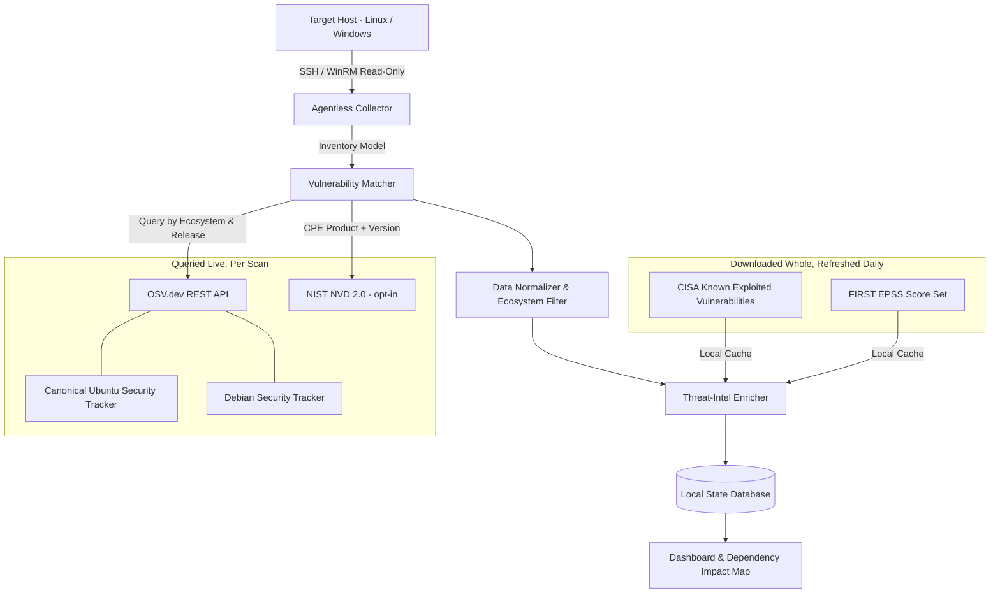
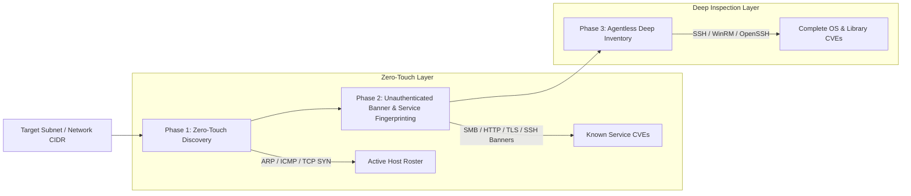
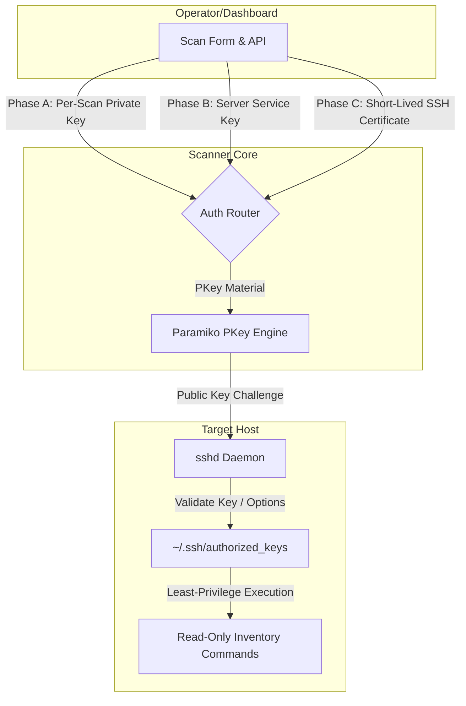
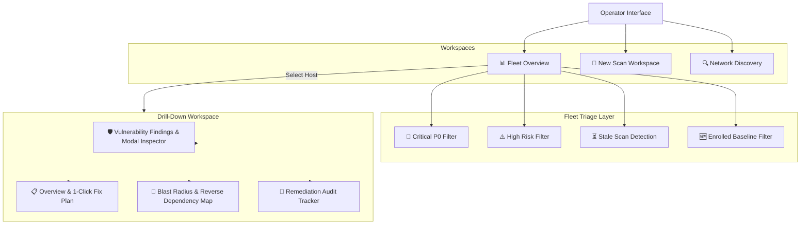

# Scanning Provenance & Vulnerability Matching Methodology

This document details the exact methodology, data provenance, and parsing algorithms used by **CveDeck** to identify CVEs, resolve package versions, assess remediation availability, and analyze dependency impact.

---

## 1. Overview & Core Philosophy

Conventional vulnerability scanners (such as generic port scanners or un-contextualized CVE matchers) often produce **alert fatigue** because they dump thousands of CVE identifiers without verifying:
1. Whether an actual security update is available in the target operating system's package repository.
2. Whether an advisory applies to an older release or sibling binary package.
3. What impact upgrading a library will have on running applications.

**CveDeck** implements an **agentless, context-aware scanning pipeline** designed for actionable remediation:
- **Zero-Footprint Collection:** Read-only SSH / WinRM inspection.
- **Strict Distribution Isolation:** Evaluates vulnerabilities strictly against the target OS release.
- **Three-Tier Classification:** Clear differentiation between actionable fixes, pending upstream patches, and resolved vulnerabilities.
- **Agentless Dependency & Blast Radius Analysis:** Automatically computes reverse dependencies to warn before an upgrade breaks dependent services.
- **Host Runtime Context:** Collects the running kernel and pending-reboot state, so a host that is fully patched but still booted into a vulnerable kernel is not reported as clean.
- **Honest Result Reporting:** A scan whose advisory source was unreachable is reported as *partial*, never as clean. See section 12.

---

## 2. Data Provenance & Upstream Feeds



**The two access patterns are deliberately different.** OSV and NVD answer
questions about a *specific package at a specific version*, so they are queried
live during a scan. KEV and EPSS are properties of a *CVE*, published as small
complete files once a day — KEV is a single ~1.5 MB JSON document, EPSS a ~2.5 MB
gzipped CSV covering every scored CVE. Querying those per finding would mean
thousands of HTTP requests to answer a question a single daily download already
answers, so they are cached locally in `kev_entries` and `epss_scores` and joined
offline. Enrichment therefore adds no network dependency to a scan.

### Upstream Sources
1. **Canonical Ubuntu Security Tracker (via OSV.dev):**
   - Canonical's authoritative database of security notices and CVE tracker for Ubuntu releases (e.g. `Ubuntu:24.04:LTS`, `Ubuntu:22.04:LTS`, `Ubuntu:20.04:LTS`).
   - Tracks which CVEs affect specific package builds and records exact fixed package versions when updates are published to `main`, `universe`, `security`, and `updates` repositories.
2. **Debian Security Bug Tracker (via OSV.dev):**
   - Official security tracking records for Debian releases (Bookworm, Bullseye, Trixie, Sid).
3. **Enterprise Linux Advisories (AlmaLinux, Rocky Linux, RHEL via OSV.dev):**
   - Official AlmaLinux OSV feeds, Rocky Linux errata, and Red Hat Security Advisories (RHSA) for Enterprise Linux 8 and 9.
4. **Alpine Linux Security Advisory Database (via OSV.dev):**
   - Alpine secfixes repository tracking vulnerabilities and fixed apk package builds across Alpine release branches (`v3.18`, `v3.19`, `v3.20`, `edge`).
5. **Arch Linux Security Advisories (via OSV.dev):**
   - Arch Linux Security Team tracker for rolling-release pacman packages.
6. **openSUSE / SUSE Security Tracker (via OSV.dev):**
   - Maintenance security updates for openSUSE Leap, Tumbleweed, and SLES.
7. **NIST National Vulnerability Database (NVD 2.0):**
   - Authoritative CVSS v3.1 vector calculations, CWE taxonomy, and vulnerability metadata.
   - Queried by CPE product and version (e.g. `cpe:2.3:o:canonical:ubuntu_linux:22.04`) for OS-level CVEs. Opt-in via `CVEDECK_NVD_ENABLED`: NVD permits 5 requests per rolling 30 seconds unkeyed and 50 with a free API key, which makes an unkeyed fleet scan slow enough to be worth an explicit decision.
8. **CISA Known Exploited Vulnerabilities catalogue (KEV):**
   - The US Cybersecurity and Infrastructure Security Agency's authoritative list of CVEs with *confirmed, observed exploitation in the wild*, each carrying a federal remediation due date and a flag for known ransomware campaign use.
   - Downloaded whole (one JSON document, ~1,700 entries) and cached in `kev_entries`.
9. **FIRST Exploit Prediction Scoring System (EPSS):**
   - A daily-refreshed model assigning every published CVE a probability (0.0–1.0) of being exploited within the next 30 days, together with that probability's percentile rank across the whole corpus.
   - Downloaded whole (one gzipped CSV, ~367,000 rows) and cached in `epss_scores`.
   - **The percentile matters as much as the score.** The EPSS distribution is extremely skewed — the overwhelming majority of CVEs sit below 0.01 — so an absolute score misleads where a rank does not. A real example from the live feed: `CVE-2015-2807` scores 0.073, which reads as negligible, and sits at the 93.9th percentile. CveDeck displays both.

---

## 3. How CveDeck Differs from Other Scanners

| Feature | Conventional Vulnerability Scanners | CveDeck |
| :--- | :--- | :--- |
| **Fix Actionability** | Flags any CVE matching a version range, even if the vendor hasn't built a patch yet. Running `apt upgrade` does nothing, confusing operators. | **3-Tier Classification:** Shows exact `(fixed in X.Y)` and 1-click copy commands only when a package update is actually available in the repository. Flags unpatched CVEs as `⏳ Pending vendor patch`. |
| **Distribution Boundaries** | Often conflates Debian and Ubuntu packages because both use `.deb` format, causing Debian-specific fix versions to appear on Ubuntu machines. | **Strict Ecosystem Isolation:** Ubuntu targets are queried strictly against Ubuntu release trackers (e.g. `Ubuntu:24.04:LTS`), eliminating cross-distro fix version leaks. |
| **Binary Subpackages** | Misses vulnerabilities when binary libraries (e.g. `libssl3`, `libcurl4`) differ in name from their source packages (`openssl`, `curl`). | **Source & Binary Mapping:** Cross-checks both top-level package metadata and `ecosystem_specific.binaries` to ensure complete library coverage. |
| **Dependency Blast Radius** | Does not know or display what services rely on a package being upgraded. | **Reverse-Dependency Graph:** Calculates which installed applications (e.g. `git`, `plexmediaserver`, `nginx`) rely on the component being remediated. |
| **Host Footprint** | Requires persistent root daemons or complex agent installations. | **100% Agentless & Read-Only:** Uses standard native remote administration protocols (`paramiko` SSH on Linux, `pywinrm` on Windows) with zero agent installation. |
| **Prioritisation** | Ranks by CVSS, so a fleet produces hundreds of indistinguishable "High" findings and no way to tell which three matter this week. | **Exploitation-Aware Ranking:** KEV → EPSS → CVSS. A CVSS 6.5 on CISA's actively-exploited list outranks a CVSS 9.8 nobody has touched, because what is happening beats what could happen. |
| **Missing Intelligence** | A feed that silently stopped updating looks identical to a clean fleet — the tool reports "0 exploited" either way. | **Unknown ≠ Safe:** An unenriched finding reports as *unknown*, never as *not exploited*. `GET /api/feeds` exposes each cache's age and staleness, and the dashboard warns when enrichment is degraded rather than presenting a missing answer as a good one. |

---

## 4. Parsing Algorithms & Normalization Rules

### A. Three-Tier Vulnerability Classification

```
                           ┌──────────────────────────────────────────────┐
                           │            Vulnerability Match Found         │
                           └──────────────────────┬───────────────────────┘
                                                  │
                                   Does Target OS Release have
                                    a 'fixed' event published?
                                                  │
                                  ┌───────────────┴───────────────┐
                                 YES                              NO
                                  │                               │
                   ┌──────────────┴──────────────┐  ┌─────────────┴─────────────┐
                   │    TIER 1: ACTIONABLE FIX   │  │ TIER 2: PENDING PATCH     │
                   │ • Fixed version shown       │  │ • Vendor patch in dev     │
                   │ • [Copy Fix Command] active │  │ • Copy button hidden      │
                   │ • 1-click selective upgrade │  │ • Logged for audit status │
                   └─────────────────────────────┘  └───────────────────────────┘
```

1. **Tier 1: Actionable Security Update:**
   - **Condition:** An advisory applies to the package version AND the entry for the **host's own release** contains an explicit `fixed: <version>`. An entry for any other release -- older, newer, or another product -- never qualifies (Req 14.8).
   - **UI Indicator:** `📦 deb:curl@8.5.0-2ubuntu10 (fixed in 8.5.0-2ubuntu10.6)`
   - **Wire representation:** The API exposes `package_name`, `fixed_version`, and `has_fix` as structured fields. Clients must use those rather than searching the identifier for the substring `"fixed in"` -- doing so made the exact wording of a human-readable display string an unversioned API contract, and it was being done in nine separate places.
   - **Action:** Displays a `[📋 Copy fix]` button whose command is chosen from the **target machine's** platform and OS (`apt`, `dnf`, `apk`, `pacman`, `zypper`, `winget`), never inferred from the package name. A bulk "fix plan" copies one deduplicated script covering every fixable package on the host. Commands are generated for the operator to review and run; CveDeck never executes anything on a target.
2. **Tier 2: Pending Vendor Patch:**
   - **Condition:** An advisory is acknowledged by the OS vendor (e.g. Canonical or Debian), but no fixed build has been released to the repository yet.
   - **UI Indicator:** `⏳ Pending vendor patch`
   - **Action:** Suppresses the upgrade copy button (prevents running commands that would result in `0 upgraded`).
   - **Fixed only in a newer release (Req 14.8):** when the host's release has no fix but a newer one does -- Debian 14 for a Debian 13 host, or Ubuntu Pro for an Ubuntu LTS -- the finding is labelled `Fixed only in Debian 14`, the drill-down says how many findings are in that position, and the fix plan lists them in a comment rather than in the upgrade command. Upgrading packages cannot clear them; upgrading the distribution does, or the release publishing the fix. Before 0.7.3 such fixes were counted as Tier 1 and put into the plan, where apt had nothing to install and every re-scan found them again.
   - **Upstream fix, unconfirmed:** when the host's release cannot be matched to the advisory at all (Fedora, Amazon Linux and SUSE, which have no per-release OSV data, or a derivative), a fix elsewhere is shown as `Upstream fix in RHEL 9` and never offered as a command.
3. **Tier 3: Remediated / Not Vulnerable:**
   - **Condition:** The host package version is equal to or greater than the fixed version.
   - **Action:** The finding is automatically cleared and archived upon re-scan.

---

### B. Epoch and Version Normalization

Debian and RPM package management systems support **epochs** (e.g., `2:23.2.6-1ubuntu0.8` where `2:` is epoch 2) to override standard version sort orders when upstream versioning changes.

* **Matching Rule:** When comparing host inventory against advisory feeds:
  - Exact match against `aff["versions"]` with epoch.
  - Normalized fallback stripping epoch prefixes (`split(":", 1)[1]`) to ensure advisories that omit or include epoch prefixes still match reliably.

---

### C. Strict Package-Name & Subpackage Filtering

Advisories frequently bundle multiple source and binary packages in a single JSON document (e.g., an X11 advisory containing `xorg-server`, `xwayland`, and `xvfb`).

* **Parsing Rule:**
  - The fix extractor strictly verifies that the `affected` record matches the specific package name under inspection (`aff["package"]["name"] == package.name` or `binary_name == package.name`).
  - Fixes from sibling packages in the same advisory (such as `2:21.1.18-1ubuntu1` for `xorg-server`) are **never** assigned to `xwayland`.

---

### D. Multi-CVE Alias Expansion

When an upstream security advisory resolves multiple vulnerabilities simultaneously:
* **JSON Structure:** `aliases: ["CVE-2024-11053", "CVE-2024-11054", "GHSA-xyz"]`
* **Parsing Rule:** CveDeck unpacks all standard `CVE-YYYY-NNNN` identifiers into distinct finding records so compliance audits have full traceability for every individual CVE.

---

### E. Multi-Tier Ecosystem Resolution & Universal Linux Fallback

To guarantee comprehensive vulnerability discovery across any Linux flavor (standard distributions, forks, container images, and custom builds), `OsvHttpClient` executes a 5-tier candidate resolution pipeline:

1. **Exact Distribution Identifier:** Uses parsed `/etc/os-release` identity (e.g. `Ubuntu:24.04:LTS`, `Debian:12`, `Alpine:v3.20`, `AlmaLinux:9`, `Rocky Linux:9`, `Red Hat`, `Fedora`, `openSUSE`, `Arch Linux`, `Wolfi`).
2. **Packaging Format Family Mappings:**
   - `.deb` $\rightarrow$ `["Ubuntu", "Debian"]`
   - `.rpm` $\rightarrow$ `["Red Hat", "AlmaLinux", "Rocky Linux", "Fedora", "openSUSE"]`
   - `.apk` $\rightarrow$ `["Alpine", "Wolfi"]`
   - `pacman` $\rightarrow$ `["Arch Linux"]`
   - `zypper` $\rightarrow$ `["openSUSE", "Red Hat"]`
3. **Release Suffix Pattern Matching:** Extracts distribution build hints from package version strings:
   - `el7`, `el8`, `el9`, `rhel`, `centos` $\rightarrow$ `["Red Hat", "AlmaLinux", "Rocky Linux"]`
   - `fc38`, `fc39`, `fc40` $\rightarrow$ `["Fedora", "Red Hat"]`
   - `suse` $\rightarrow$ `["openSUSE"]`
   - `arch` $\rightarrow$ `["Arch Linux"]`
   - `-rN` $\rightarrow$ `["Alpine", "Wolfi"]`
4. **Custom Ecosystem Tags:** Preserves explicit custom repository names.
5. **Universal Total Linux Fallback:** If a package is untagged or from an unrecognized Linux environment, it queries every ecosystem in `_ALL_LINUX_ECOSYSTEMS` in parallel through the OSV `/querybatch` endpoint.

**Every name in that list must be one OSV actually accepts.** `/querybatch` rejects the *entire batch* with HTTP 400 when a single query names an unknown ecosystem (`error in query at index N: invalid ecosystem`), and the client's error path then falls back to querying each item individually. The failure is therefore invisible: results stay correct while batching -- the whole point of the two-phase design -- silently stops working, turning ~20 batched requests into ~10,000 individual ones on a 1,000-package host.

`Arch Linux` and `Fedora` were both in this list and are both invalid, so the universal fallback never batched successfully until this was found. Distributions with no OSV tracker of their own (Oracle Linux, Amazon Linux, Fedora, Arch) resolve onto the upstream they derive from rather than being queried under a name OSV will reject.

#### Release-specific matching (Req 14.7)

OSV describes a Linux vulnerability once per distribution release, each with its own fix. Asking OSV about a whole distribution compares the installed version against *every* release's fix, so a fully patched Debian 13 `curl` came back "vulnerable" to anything Debian 14 fixed at a higher version number: 49 advisories when asked about `Debian`, 25 when asked about `Debian:13`.

The collector therefore records the release wherever OSV tracks one -- `Debian:13`, `Ubuntu:24.04:LTS` or `Ubuntu:25.10` (including derivatives via `UBUNTU_CODENAME`), `Alpine:v3.20`, `AlmaLinux:9`, `Rocky Linux:9`, `Red Hat:9`, `openSUSE:Leap 15.6` -- and each package is asked about twice in the same batch: the distribution as a whole, which is the superset and never misses anything, and the release on its own (`Red Hat:enterprise_linux:9::baseos`, `appstream` and `crb` for RHEL and its rebuilds). An advisory is then dropped only when:

- it has an entry for the host's release and OSV did not match the installed version there, or
- it names the host's distribution but none of its releases -- a Debian advisory listing only Debian 14, or a Red Hat advisory for another product -- **and** the release demonstrably appears somewhere in the scan's advisories.

Nothing is dropped when the release query failed, returned a paged (incomplete) answer, or names a release no advisory mentions: an end-of-life Ubuntu interim is answered with silence, and silence must not turn a host clean. `tests/test_release_matching.py` pins those cases, and the advisory shapes it uses are taken from the live entries that exposed the problem.

Note also that `Red Hat` is queried **unversioned**. OSV *accepts* `Red Hat:9` and returns zero results for it, while `Red Hat` returns real findings for the same package -- so a version suffix here succeeds while silently losing every finding. This differs from `AlmaLinux:9` and `Rocky Linux:9`, which are both versioned and both work, which is exactly what makes the mistake easy to make. `tests/test_ecosystem_resolution.py` pins the valid and invalid sets.

---

### F. CVSS Base Score Calculation

To guarantee score integrity even when third-party feeds supply only raw vector strings:
1. **CVSS v3.1 Formula Engine:** Evaluates the standard vector `CVSS:3.1/AV:N/AC:L/PR:N/UI:N/S:U/C:H/I:H/A:H` using official FIRST CVSS v3.1 specification math (Impact Sub-Score $ISS$, Exploitability, Scope multipliers), including the specification's `Roundup` function rather than a plain ceiling.
2. **CVSS v4.0 MacroVector Engine:** Reduces a `CVSS:4.0/...` vector to its six-digit MacroVector, reads that MacroVector's score from the 270-entry table published in specification section 8.2, and interpolates downwards by the mean proportional severity distance to the vector being scored. Ported from the FIRST reference calculator and verified against it across the base-metric space; without it, every v4-only advisory was unreadable.
3. **Qualitative Severity Mapping:** For feeds that publish a severity *word* and no vector, the word is recorded as the Severity_Level and **no CVSS score is recorded**. The band is a statement by the advisory's author; the number is not.
4. **No default score.** An advisory publishing neither a parseable vector nor a qualitative word is recorded as `unscored`, with an absent CVSS score.

> **This section used to read "Safe Default: defaults to $5.0$ if no vector or
> score is supplied", and the qualitative mapping used to invent $9.5 / 8.0 /
> 5.5 / 2.5$.** Neither was safe. A substituted $5.0$ was reported as *Medium*,
> indistinguishable in the API, the dashboard and the CSV export from an
> advisory OSV genuinely scored 5.0 -- on the one field the entire triage
> ranking is built on. A score and a severity are independent facts: either can
> be published without the other, and CveDeck now records exactly what the feed
> said. An unmeasured finding ranks below Critical and above High, because it
> could be either. See Requirements 2.6, 2.7 and 10.11.

---

## 5. Remediation Strategies for Pending Vendor Patches & Patch Readiness Filtering

When a vulnerability is acknowledged by an OS vendor but no package update has been published to the standard distribution repository yet, CveDeck provides structured operational workflows:

> **Tooling selection.** Every command below is chosen from the target machine's
> platform and reported OS. It is deliberately *not* inferred by substring-matching
> the package identifier, which had matched `ol` inside `tool`, `console`, and
> `golang`, and `arch` inside `libarchive` and `noarch` -- routing Debian packages
> to `dnf` and `pacman`. Where the distribution cannot be determined, CveDeck emits
> a comment rather than a guessed command: a confidently wrong command is worse
> than an admission of uncertainty.
>
> Note also that Arch is offered `pacman -Syu` rather than a single-package
> upgrade, because partial upgrades are explicitly unsupported upstream.

### A. Patch Readiness Filtering
The dashboard includes an interactive filter bar to separate actionable updates from waiting advisories:
- **`🚀 Ready to Fix`**: Filters strictly for packages where a native package update command (e.g. `apt install --only-upgrade <pkg>`, `dnf upgrade <pkg>`, `apk add --upgrade <pkg>`) will successfully install a security fix.
- **`⏳ Pending Patch`**: Filters for vulnerabilities awaiting upstream vendor builds.

### B. Alternative Remediation Pathways for Pending CVEs
1. **Unused Leaf Package Purge:**
   - Packages with a **Low Blast Radius** (0 dependent applications on the host, e.g. standalone GUI tools like `thunderbird`, `snapd`, or unused daemons) can be safely purged via native tooling:
     - **Debian / Ubuntu:** `sudo apt remove --purge <package>`
     - **RHEL / CentOS / AlmaLinux / Rocky / Fedora:** `sudo dnf remove <package>`
     - **Alpine Linux:** `sudo apk del <package>`
     - **Arch Linux:** `sudo pacman -R <package>`
     - **openSUSE / SLES:** `sudo zypper remove <package>`
   - Completely removes the package binary and configuration, eliminating its CVE attack surface with zero dependency risk.
2. **Ubuntu Pro / Extended Security Maintenance (ESM)** *(shown for Ubuntu targets only)*:
   - Canonical publishes backported security fixes for `universe` and `multiverse` packages exclusively to Ubuntu Pro subscribers (`esm-apps` and `esm-infra`).
   - This guidance is gated on the detected distribution. It was previously rendered for every host, so RHEL and Alpine operators were told to run `sudo pro enable esm-apps`, which does not exist on those systems.
   - Operators can check coverage and enable streams using:
     ```bash
     sudo pro status
     sudo pro enable esm-apps
     ```
3. **Distribution Release Upgrade:**
   - Upstream maintainers often patch vulnerabilities in newer distribution series rather than backporting fixes to older releases. Operators can test for available release upgrades using:
     - **Ubuntu:** `sudo do-release-upgrade -c`
     - **RHEL / Fedora:** `sudo dnf check-update`
     - **Alpine:** `sudo apk update && sudo apk list -u`
     - **Arch Linux:** `sudo pacman -Syu`
     - **openSUSE:** `sudo zypper list-updates`

---

## 6. CVE Intelligence Drawer & Removal Safety Protocol

To prevent accidental system service outages during remediation audits, CveDeck integrates deep vulnerability intelligence directly into the inspection workflow:

### A. Real-Time Removal & Impact Assessment
Before purging or modifying any software component, operators must assess whether active services rely on it. CveDeck dynamically calculates:
- **Impact tier:** How many installed packages declare a dependency on the component decides the warning, in the same three tiers the badge shows — high at ten or more dependents, moderate at three or more, low below that. A package with three dependents reads "Moderate system impact" in both places; the card used to shout "high" for any dependent at all, contradicting the badge beside it.
- **Standalone Safety Check (`CHECK USAGE BEFORE PURGING`):** When the package has zero dependents on the machine (`depended_on_by.length === 0`) *and* the dependency graph was actually built, operators are prompted to confirm whether the service/tool is actively used before issuing a purge.
- **Not assessed:** Where no dependency graph exists — no collected inventory, a finding with no package name, a package manager that reports no dependencies — the impact is stated as unassessed and no purge is offered. An empty dependents list is not evidence that nothing depends on the package.

### B. Upstream Intelligence Direct Links
Every CVE identifier across all dashboard views opens an interactive investigation drawer linking directly to authoritative sources:
- **NIST NVD:** Direct access to CVSS v3.1 vector breakdowns, CWE weakness classifications, and CPE configurations.
- **Ubuntu Security Tracker:** Distribution-specific status tracking (Noble 24.04, Jammy 22.04, Focal 20.04) and package build versions.
- **Open Source Vulnerabilities (OSV):** Upstream ecosystem commit hashes, affected git tags, and vulnerability aliases.
- **MITRE CVE Dictionary:** Industry-standard CVE records and vendor acknowledgments.

---

## 7. High-Concurrency Advisory Engine & Master-Detail UI Architecture

As target hosts scale up to 1,000+ installed packages and hundreds of CVEs, CveDeck employs layered performance optimizations across both backend collection and frontend rendering:

### A. Backend Advisory Caching & High Concurrency
1. **Thread-Safe In-Memory Advisory Cache:**
   - Packages across machines often share identical versions (e.g. `libssl3@3.0.13-0ubuntu3.4`).
   - `OsvHttpClient` caches advisory query results in memory (`self._advisory_cache`), eliminating redundant HTTP round trips across consecutive scans.
2. **High-Concurrency Worker Pool:**
   - Uses 25 concurrent worker threads (`_DEFAULT_MAX_WORKERS = 25`) with HTTP connection pooling (`_DEFAULT_POOL_SIZE = 50` keepalive, 100 max connections) to resolve detailed vulnerability advisories concurrently.
   - Both constants are read on the code path that constructs the client itself, which is the path every deployment takes and the one no test exercised until `tests/test_osv_client_live_path.py` was added. A missing constant there produced a `NameError` that the matcher recorded as an unreachable data source, so every live scan returned zero findings while reporting success.
3. **Two-Phase Query Strategy:**
   - A `/querybatch` pass identifies which `(package, ecosystem)` pairs have any findings; only those get a full `/query` for advisory detail.
   - This is why ecosystem-name validity matters so much (section 4.E): a single unrecognized name fails the entire batch, and the client's fallback path then queries every item individually. Results stay correct, so nothing looks broken, while the optimisation silently stops applying.
4. **$O(N)$ Reverse-Dependency Indexing:**
   - Single-pass forward and reverse mapping minimizes computation overhead during scan ingestion.
   - **Where the graph comes from, per package manager.** Each manager is dispatched on an explicit presence test and normalised to `name<TAB>version<TAB>depends`:

     | Manager | Source | Depends field |
     | :--- | :--- | :--- |
     | dpkg | `dpkg-query -W` | `${Depends}` — parenthesised constraints, `\|` alternatives, `:arch` qualifiers |
     | rpm | `rpm -qa --qf` | `[%{REQUIRENAME},]`, iterating the array |
     | apk | `/lib/apk/db/installed` | `D:` records — space-separated, `so:`/`cmd:`/`pc:` capabilities |
     | pacman | `/var/lib/pacman/local/*/desc` | `%DEPENDS%` section |

     Only names the manager gave as packages are kept: file paths (`/usr/bin/sh`), sonames (`libc.so.6()(64bit)`), apk capabilities, rpm internals (`rpmlib()`, `config()`, `rtld()`) and version constraints are all dropped, because this list is shown to the reader *and* counted to derive the blast radius, so a name resolving to no installed package inflates the dependents of everything requiring it (Req 10.13).

     An arch-qualified or versioned rpm provide — `rpm-libs(x86-64)`, `rocky-repos(9)` — **is** a real package and is kept. Dropping every token containing parentheses is the obvious way to remove the rpm noise and costs 24 genuine edges on a stock Rocky 9 host.

   - **Before 0.8.7 this was correct only on dpkg.** `%{REQUIRES}` expands to the *first* element of rpm's requires array, so RPM hosts reported one dependency per package — usually a file path. The apk arm collected no dependency data at all. The pacman arm was unreachable, because it was chained after a shell *pipeline* whose `sed` exits 0 on empty input, so Arch hosts collected nothing and were refused under Req 1.7. Measured on stock containers, resolvable dependency edges went 16 → 120 on Rocky 9, 0 → 9 on Alpine 3, and 0 → 472 on Arch; Debian was unchanged at 140, which is why nothing looked wrong.
   - The apk and pacman databases are read directly rather than through `apk info -R` / `pacman -Qi`: one read instead of a per-package loop, and `pacman -Qi`'s field labels are localised, so parsing them breaks on a host that is not in English.

### B. Master-Detail Split-Pane & DOM Pagination
1. **Master-Detail Workspace:**
   - The left pane renders a compact, high-density vulnerability table with instant keyboard and mouse row selection.
   - The right pane displays a sticky, real-time Detail Inspector showing the active CVE's CVSS score gauge, fix readiness status, blast-radius impact warnings, and external links.
2. **Client-Side Pagination:**
   - Findings and package groups are paginated (`15`, `25`, `50`, `100` items per page), rendering only the visible subset to ensure sub-millisecond DOM update cycles and zero scroll latency.
3. **Contextual Workspace Tabs:**
   - `🚀 Ready to Fix`, `⏳ Pending Vendor Patch`, `📋 All Findings`, `📦 By Package`, and `🌳 Dependency Map` allow instant context switching without full page reloads.
4. **Linkable Screens:**
   - Navigation is held in the URL fragment (`#/fleet`, `#/scan`, `#/machines/<id>`), so a host's findings can be linked, bookmarked, and reached with browser back.
   - A fragment rather than a path, deliberately: the dashboard is served from FastAPI's `StaticFiles` mount and usually sits behind whatever reverse proxy the operator already runs. A path route would return 404 on refresh unless every such deployment is configured with an SPA fallback — a support burden paid by operators to buy a prettier URL. A fragment never reaches the server and therefore cannot break behind an unfamiliar proxy.

### C. Presenting Exploitation, Not Just Severity

Collecting the KEV and EPSS signals (§2) is only half the job; a signal that never reaches the screen where the decision is made has not been delivered.

1. **Ranking:** both the fleet list and the findings table order by **KEV → EPSS → CVSS** by default. A CVSS 6.5 that CISA lists as actively exploited outranks a CVSS 9.8 that nobody has touched. Alphabetical ordering, which the fleet list used previously, is a filing order rather than a triage order, and it buried exploited hosts among their peers.
2. **Three visual states, never two.** Every surface showing exploitation renders `kev_listed` as three distinct things — listed, checked-and-absent, and *not checked*. The third is a muted dash, never a zero. A zero is an assertion; a dash is the honest absence of one. This is §12.E carried through to pixels, and it is why the fleet's "Actively Exploited" card reads *"no exploit data loaded"* rather than *"0"* when no feed has ever refreshed.
3. **Every screen that shows a host shows its exploitation state.** The fleet
   list, the host summary, and each finding row all render it, and all three use
   the same three-way distinction. A signal that appears on the overview and
   disappears when the operator clicks through to act on it has been delivered to
   the wrong screen.
4. **Colour is scarce, so it carries meaning.** Three tiers and nothing else:
   neutral for interface chrome, a single amber ramp for severity, and red
   reserved exclusively for confirmed exploitation. Previously severity used four
   hues including red, so a Critical-but-unexploited finding and an actively
   exploited one were the same colour — rendering both treatments side by side
   showed the red Critical counts swamping the exploitation marks, so the
   palette was arguing against the ranking the engine had just established.
5. **Units are stated, not implied.** Host counts and finding counts are visually distinct and each carries its unit ("3 hosts · 25 findings"). Two adjacent panels measuring different quantities in the same style is a defect that lives in the relationship between them rather than in either one, which makes it invisible to unit tests and obvious in a screenshot.

---

## 8. Zero-Touch Network Discovery & Unauthenticated Fleet Scanning Roadmap

To achieve automated whole-network discovery and assessment without manually configuring endpoints or modifying host configurations, the vulnerability management architecture supports a layered discovery-to-deep-scan progression:



### A. Phase 1: Subnet Sweep & Network Asset Discovery (Implemented in v0.3.0)
- **Mechanism:** Multi-port TCP connect discovery across standard enterprise ports (`22` SSH, `80`/`443` HTTP, `445` SMB, `3389` RDP, `5985` WinRM), ICMP echo sweep, and unauthenticated banner extraction.
- **Zero-Touch Guarantee:** No agents installed and no credentials required; identifies active IP addresses, hostnames, open listeners, and inferred OS families with `/20` subnet safety limits.
- **Fleet Enrollment & Quick Scan Workflow:** Discovered hosts can be enrolled directly into the fleet roster (`POST /api/discovery/enroll`) individually or in bulk, and pre-populated into the scan form for 1-click credentialed inspection.
- **Session Caching & Tab Persistence:** Subnet sweep results and CIDR inputs persist in browser session storage, preventing redundant network sweeps when switching between fleet and discovery views.
- **Dynamic Platform Auto-Detection:** Typing or selecting a target automatically infers and selects `Linux (SSH)` vs `Windows (WinRM)` using known fleet metadata and discovery banner signatures, displaying an auto-detection hint without disrupting form alignment while preserving operator manual override.
- **Fast Connection Failure & Timeout Hardening:** 2.5s TCP pre-flight connect probes and 5s operation timeouts for WinRM and SSH ensure unreachable or blocked endpoints fail cleanly in seconds rather than hanging on socket timeouts.
- **RFC 4180 CSV Data Export:** 1-click downloads across Fleet Overview, Machine CVE Drill-Down, and Network Discovery views.

### B. Phase 2: Unauthenticated Remote Fingerprinting & Banner Matching
- **Mechanism:** Remotely probes exposed network services without authenticating:
  - **SMB & NetBIOS Negotiation:** Queries SMB dialect and OS version build strings directly over port `445`.
  - **HTTP/HTTPS Headers & TLS Fingerprints:** Extracts server banners (e.g. `Apache/2.4.52`, `nginx/1.18.0`) and application versions.
  - **SSH Protocol Banner:** Reads the remote daemon identifier (e.g. `SSH-2.0-OpenSSH_8.9p1 Ubuntu-3ubuntu0.6`).
- **Matching Pipeline:** Correlates extracted software identifiers against NVD CPEs and OSV advisory databases to flag network-exposed vulnerabilities with zero host credentials.

### C. Phase 3: Push-Based Local Inventory (Zero Inbound Open Ports)
- For locked-down endpoints (e.g. client laptops where all inbound ports `5985`/`22` are blocked by host firewalls):
  - A standalone, single-executable script or scheduled task runs locally as the current user, gathers local inventory via read-only WMI/CIM, and pushes results outbound over HTTPS to `POST /api/scans/ingest`.
  - Eliminates the need to open inbound ports or relax UAC network token policies on client endpoints.

---

## 9. Target Architecture Roadmap: Linux-First Execution & Windows Research Tracks

> **Status since 0.6.0: Windows scans are refused.** Windows hosts can be discovered
> and enrolled, and the WinRM collector exists, but none of the three tracks below
> is built, so nothing can match what the collector gathers. OSV has no Windows
> ecosystem and rejects the query; OS-level exposure lives in cumulative updates
> that Track 3 would map. A Windows scan would therefore finish with zero findings,
> indistinguishable from a clean host, so `POST /api/scans` refuses it with that
> reason (Requirement 10.8). This lifts together with real matching, not before.

### A. Operational Focus: Linux-First Production Scanning
The active production scanner and remediation pipeline is optimized and prioritized for **Linux environments** (Debian, Ubuntu, RHEL, CentOS, Fedora, and derivatives):
1. **Agentless SSH Read-Only Mechanics:** Standard POSIX tools (`cat /etc/os-release`, `dpkg-query`, `rpm -qa`) provide instantaneous, 100% non-invasive software inventory extraction without administrative elevation workarounds.
2. **Deterministic Advisory Matching:** Native integration with Ubuntu Security Trackers and OSV.dev provides exact version range evaluation, companion package isolation (`_extract_fixed_version`), and actionable 1-click remediation commands generated per distribution (`apt`, `dnf`, `apk`, `pacman`, `zypper`).
3. **Graph-Based Reverse Dependency Intelligence:** Immediate blast-radius calculation for libraries (e.g. `libssl3`, `glibc`) prevents service disruption during patching.

### B. Windows Research & Engineering Roadmap Tracks
Windows inventory collection and CVE correlation involve distinct architectural challenges (WinRM transport configuration, UAC remote credential filtering, registry variation, and KB update mapping). Future development is organized across three dedicated research tracks:

```mermaid
flowchart TD
    subgraph Track1["Track 1: Inbound WinRM & Network Security"]
        T1A[Kerberos vs NTLM Auth] --> T1B[LocalAccountTokenFilterPolicy Research]
        T1B --> T1C[WinRM HTTPS 5986 Cert Provisioning]
    end

    subgraph Track2["Track 2: Outbound Push-Based Ingest"]
        T2A[Zero Inbound Open Ports] --> T2B[Lightweight PowerShell / Go Probe]
        T2B --> T2C["POST /api/scans/ingest Endpoint"]
    end

    subgraph Track3["Track 3: Windows Advisory & CPE Correlation"]
        T3A[Win32_QuickFixEngineering KB Mapping] --> T3B[Microsoft MSRC API & NVD 2.0 CPEs]
        T3B --> T3C[Winget & MSI Registry Normalization]
    end
```



1. **Track 1: Inbound WinRM & Remote Elevation Security**
   - **UAC Remote Token Filtering:** On non-domain Windows workstations and standalone servers, remote administration over WinRM strips administrative privileges unless `LocalAccountTokenFilterPolicy` is configured or built-in Administrator accounts are used.
   - **Transport Security:** Transitioning from HTTP NTLM (port `5985`) to HTTPS with automated certificate provisioning (port `5986`) or Active Directory Kerberos SPNs to ensure enterprise-grade confidentiality.
   - **Zero-Modification Policy:** Investigating ways to query basic system status without requiring IT policy changes on managed endpoints.

2. **Track 2: Zero-Port Outbound Push Collector (`POST /api/scans/ingest`)**
   - **Firewall Bypass Without Inbound Exposure:** Workstations often strictly drop all inbound connections. An outbound-only model allows endpoints to execute a digitally signed, read-only PowerShell or Go binary and report inventory to CveDeck over HTTPS.
   - **Data Collection Scope:** Reads `Get-CimInstance Win32_OperatingSystem`, `Win32_QuickFixEngineering` (applied KBs), registry uninstall keys (`HKLM:\Software\Microsoft\Windows\CurrentVersion\Uninstall`), and `winget list`.

3. **Track 3: Microsoft MSRC & NIST NVD CPE Advisory Mapping**
   - **Cumulative Update Complexity:** Unlike Linux packages where version strings directly increment (`3.0.13` -> `3.0.14`), Windows vulnerabilities are mitigated through cumulative Quality Updates (KB numbers) and servicing stack updates.
   - **MSRC API Integration:** Integrating the Microsoft Security Response Center (MSRC) CVRF/CSAF API to correlate installed KB numbers against Windows OS builds (e.g. Windows 11 23H2 build 22631.3880) and eliminate false-positive OS-level findings.

---

## 10. Agentless SSH Authentication Architecture & Enterprise Credential Security

### A. Background & Enterprise Hardening Context
In hardened enterprise Linux servers, **password authentication is explicitly disabled** (`PasswordAuthentication no` in `/etc/ssh/sshd_config`) to comply with CIS benchmarks, NIST SP 800-53, and PCI-DSS requirements. To operate seamlessly across zero-trust and hardened infrastructures, CveDeck supports an extensible, secure credential architecture.



---

### B. Multi-Phase SSH Authentication Strategy

#### 1. Phase A: Per-Scan SSH Private Key & Passphrase (Implemented)
Allows operators to authenticate using modern cryptographic private keys instead of passwords on a per-scan basis:
- **Domain Model Extension:**
  ```python
  class Credentials(BaseModel):
      model_config = ConfigDict(frozen=True)
      username: str
      password: SecretStr | None = None
      private_key: SecretStr | None = None      # PEM / OpenSSH private key
      passphrase: SecretStr | None = None       # Optional key passphrase
  ```
- **Cryptographic Key Loading (`paramiko.pkey`):**
  `parse_private_key` attempts **Ed25519** (preferred), **ECDSA**, then **RSA**, with passphrase decryption when protected. RSA is tried last because its loader is the most permissive and raises the least informative error on a key of another type. Key material is held only in memory -- a per-request secret written to a temp file would outlive the request that supplied it.
  A wrong or missing passphrase is reported distinctly from a malformed key, since the two call for different user actions. Parsing runs **before** an SSH client is allocated, so a bad key is never reported as a connection failure.
- **Frontend Experience:**
  The scan form provides an intuitive **Authentication Mode** selector (`Password` vs `SSH Private Key`), supporting pasted PEM text or file uploads with immediate syntax validation.

#### 2. Phase B: Server-Managed Enterprise Keyring (Implemented)
Designed for continuous fleet management and one-click bulk scanning:
- The CveDeck server maintains a dedicated scanner key pair (e.g., `/etc/cvedeck/id_ed25519`) configured via `CVEDECK_DEFAULT_SSH_KEY_PATH`.
- Operators scanning discovered fleet hosts may supply only the service account username (e.g. `scanner-svc`), or omit it entirely and let `CVEDECK_DEFAULT_SSH_USER` apply; the engine attaches the pre-configured server key.
- The key is re-read from disk on every scan, so rotating it takes effect without restarting the service.
- `GET /api/health` reports `capabilities.server_ssh_key`, and the dashboard hides its fleet re-scan controls when no key is configured rather than offering an action that must fail.
- Windows has no equivalent: WinRM offers no SSH-key analogue, so a Windows target without credentials is rejected rather than attempted.

#### 3. Phase C: Short-Lived Signed SSH Certificates (Zero-Trust Infrastructure)
For modern zero-trust environments (HashiCorp Vault, Teleport, Smallstep):
- CveDeck requests an ephemeral, short-lived (e.g. 5-minute) SSH user certificate from the enterprise CA.
- Target endpoints validate the certificate signature against their trusted CA bundle (`TrustedUserCAKeys`), completely eliminating persistent authorized keys on target hosts.

---

### C. Security, Cryptographic & Operational Considerations

| Consideration Area | Requirement & Design Decision |
| :--- | :--- |
| **Secret Sanitization** | Private keys and passphrases are wrapped in Pydantic `SecretStr`. They are never logged, serialized in JSON responses, or stored in database tables. Private keys reside in memory strictly for the duration of the inventory SSH session. |
| **Key Format Interoperability** | Supports modern OpenSSH format (`BEGIN OPENSSH PRIVATE KEY`), traditional PEM headers (`BEGIN RSA/DSA/EC PRIVATE KEY`), and PKCS#8 structures. Ed25519 is prioritized for performance and security. |
| **Target Host Least-Privilege** | Target hosts should restrict the dedicated audit user via `~/.ssh/authorized_keys` options: <br>`no-port-forwarding,no-X11-forwarding,no-agent-forwarding,no-pty,command="..." ssh-ed25519 AAAAC3...` |
| **Fault Isolation & Error Safety** | Failed key decryption (bad passphrase), invalid key syntax, or rejected public keys raise `AuthError` (`AUTH_FAILURE`), maintaining per-target batch isolation without crashing scanner engines. |
| **Host Key Trust (Req 17)** | A host's SSH key is pinned on the first connection that succeeds, and every later connection is held to it. A host presenting a different key is refused after key exchange and *before* authentication, so no credential reaches it; the refusal is `HOST_KEY_MISMATCH`, never a connection failure. The pinned key type is negotiated first, so a host with several key types is not refused for offering another. `CVEDECK_SSH_HOST_KEY_POLICY=strict` refuses hosts with no pin instead of trusting on first use. Only an explicit, signed-in **Forget host key** changes a pin. |
| **Zero-Disk In-Memory Parsing** | User-submitted private keys are parsed entirely in memory via `io.StringIO` streams; no temporary files are ever written to the host filesystem. |

---

## 11. Scanner Engine Reliability, Command Timeout Architecture & Fault Isolation

To ensure stability across heterogeneous enterprise networks, CveDeck implements a hardened execution model designed for large package inventories and unpredictable network latency:

### A. Two-Tier Timeout Architecture
1. **Socket Connect Timeout (`_CONNECT_TIMEOUT = 5.0s`):**
   - Applied during the initial TCP three-way handshake and SSH authentication exchange.
   - Prevents the engine from hanging on offline or firewalled IP addresses.
2. **Command Execution Timeout (`_COMMAND_TIMEOUT = 45.0s`):**
   - Applied when reading system package databases over SSH (e.g. `dpkg-query -W ...` or `rpm -qa ...` across 1,000+ packages and full dependency trees).
   - Prevents premature connection resets on active enterprise Linux hosts while streaming large inventory output.

### B. Comprehensive Fault Isolation (Property 1)
- The scanner engine enforces strict per-target error isolation:
  - If a single target endpoint suffers an SSH timeout, network drop, or authentication failure, it is cleanly recorded as `CONNECTION_FAILURE` or `AUTH_FAILURE`; a refused host key is recorded as `HOST_KEY_MISMATCH` or `HOST_KEY_UNKNOWN` (Req 17.3, 17.5), which are refusals rather than failures to reach the host.
  - The failure is isolated to that specific machine and never aborts remaining batch scans or crashes the outward-facing HTTP API (`POST /api/scans`).
  - A target whose credentials cannot be resolved at all fails the same way, before the engine is reached.
- **Degradation applies to outages, not to defects.** `Matcher.match` records a
  network or HTTP failure as `DATA_SOURCE_UNAVAILABLE` and continues, but
  re-raises `NameError`, `TypeError`, `AttributeError`, and `ImportError`.
  Catching those alongside real outages converted a crash into a silent false
  negative: a scan that reported success with zero findings. Graceful degradation
  around someone else's outage is resilience; graceful degradation around your own
  bug is data loss.

### C. Pre-Flight Connection Testing
- Operators can run a sub-second pre-flight diagnostic (`POST /api/scans/test-connection`) before initiating full scans.
- Probes reachability of the configured SSH port (`CVEDECK_SSH_PORT`, default 22) or WinRM port, and performs read-only identity verification (`uname -a`, `/etc/os-release`), displaying real-time round-trip latency (ms) and detected remote operating system banners.
- Credentials are resolved through the same code path as a real scan, so pre-flight and the scan itself can never disagree about how a host is reached.
- Host keys are pinned and checked through that same path too (Req 17.6): a key accepted here is the key the next scan is held to, and a pre-flight against a changed key is refused exactly as the scan would be. It reports the pinned fingerprint, which is what an operator compares against `ssh-keygen -lf` on the host.

---

## 12. Result Trustworthiness: Distinguishing "Clean" from "Unknown"

A vulnerability scanner's worst failure mode is not a crash -- it is reporting a
clean result it did not actually establish. A fleet row reading
`web-01 - linux - success - 0 0 0 0` has four possible meanings, only one of
which is good news:

1. The host is genuinely clean.
2. The host was scanned while an advisory source was unreachable, so the findings
   are partial.
3. The host was scanned months ago and nothing has looked since.
4. The host was enrolled from a discovery sweep and has never been scanned.

CveDeck reports each distinctly.

There is a fifth meaning, and it is the one that got through: *the host was
scanned, a source failed, and the client reported the failure as an empty
answer.* Every distinction below depends on a failed lookup reaching the matcher
as a failure. Until 0.6.0 the OSV client caught each failed query and returned no
advisories, so an OSV outage produced meaning 1 while actually being meaning 2 —
and the test for partial results passed, because it used a fake client that
raised. A data-source client must raise when any query goes unanswered, and
degradation is tested through the real client. See `AGENTS.md` §3.

### A. Partial Results

`MatchResult` carries a per-source reachability status. That status propagates to
`MachineScan.unavailable_sources`, is persisted as
`target_machines.last_scan_sources_ok`, and is serialized on both the scan
response and every machine summary. The dashboard renders a `⚠ Partial` badge
and raises a warning notification.

**Only *configured* sources count as unavailable.** NVD ships disabled by default
(`CVEDECK_NVD_ENABLED`), and a deployment that has not opted in must not have
every scan branded partial -- that would train operators to ignore the warning
entirely, destroying the value of the signal. An absent capability is a
documented limitation; an outage is a per-scan anomaly worth interrupting someone
about. When NVD *is* enabled, a 403 or 429 from its rate limiter surfaces as a
genuine outage, so a throttled scan reports partial results rather than reading
as clean.

### B. Scan Recency

`last_scanned_at` is recorded per machine and rendered as relative age, with scans
older than seven days flagged as stale. A finding set is a claim about a moment in
time, and the age of that moment is part of the claim.

### C. Never-Scanned Hosts

`ScanStatus.NEVER_SCANNED` is the state of a machine that exists in the roster but
has had nothing attempted against it -- typically one enrolled from a discovery
sweep. It renders neutral. Enrollment previously stamped `CONNECTION_FAILURE`, so
every newly enrolled host displayed a red failure badge for a connection nobody
had tried to make, which teaches operators that red badges are noise.

### D. Actionable Failure Messages

Per-target failures carry the originating error message alongside the status. A
bare `auth_failure` gives an operator no way to tell a wrong password from a wrong
username from a rejected key, and a bare `connection_failure` does not distinguish
a DNS failure from a filtered port.

### E. Unenriched Is Not Unexploited

The same failure mode reappears one level down, in threat intelligence, and is
handled the same way.

`cve_findings.kev_listed` is deliberately **three-valued**:

| Value | Meaning |
| :--- | :--- |
| `NULL` | Not checked. No usable KEV cache existed when this finding was written. |
| `False` | Checked, and genuinely absent from CISA's catalogue. |
| `True` | Listed as actively exploited in the wild. |

Collapsing `NULL` into `False` would be a one-character change producing the
worst available outcome: a dashboard reporting "0 actively exploited" across an
entire fleet, on the authority of a catalogue that was never downloaded. That is
not a display bug. It is the tool asserting a security conclusion it has no
evidence for, in the direction that stops someone looking further.

The distinction is preserved at every layer, and each one is separately tested:

- **Persistence** — the columns are nullable, and the migration leaves
  pre-enrichment findings `NULL` rather than backfilling `False`. Those rows were
  written before enrichment existed; nothing checked them.
- **Enrichment** — `FindingEnricher` writes a `False` only when a feed is
  *usable*, meaning it refreshed successfully **and** returned a non-empty
  catalogue. An unusable feed leaves every field `NULL`.
- **API** — `CveFindingOut` types these as `bool | None` / `float | None`, and the
  contract test asserts the nullability rather than merely the presence of the keys.
- **Client** — `client.ts` maps with `?? null`, never `?? false`.
- **Presentation** — `isKnownExploited` in `src/lib/intel.ts` uses `=== true`, so a
  `null` cannot slip through a truthiness check. The table renders three visually
  distinct states: `🎯 Exploited`, `Not on KEV`, and a muted `— unknown`.

Two related guarantees support it:

**A failed refresh never empties a good cache.** `FeedRefreshService` records the
failure and leaves the previous catalogue in place, because yesterday's KEV answer
beats no answer. An empty catalogue returned with HTTP 200 is treated as a failure
rather than written — a feed that changed shape upstream must not be allowed to
erase every exploitation flag in the fleet.

**Staleness is reported, not hidden.** `feed_refreshes.last_refreshed_at` advances
only on success, so a feed that has been failing for a week reports week-old data
rather than a fresh-looking timestamp from its last retry. `GET /api/feeds`
exposes the age, record count, and staleness of each cache, and the fleet view
raises a banner when enrichment is degraded. A stale cache still enriches —
withholding a nearly complete answer to avoid a marginally incomplete one helps
nobody — but the operator is told what they are looking at.

### F. What Changed Between Scans

After a patch round the question is "what did that clear, and is anything new?"
A diff between two scans can answer it, and it can also lie in exactly the ways
this section exists to prevent: a finding that disappears because OSV did not
answer looks the same as one a patch fixed. So a scan's changes follow the same
rule as everything above. When CveDeck does not know, it says so.

- **Same finding means same CVE and same package name.** The version is left out.
  A package upgraded to a newer build that is still vulnerable is the same open
  problem. It is not one finding resolved and another new, which would inflate
  both counts after every partial upgrade. A finding keeps its first-seen date for
  as long as it is found.
- **A partial scan resolves nothing.** If a configured source did not answer,
  findings the scan did not report are kept exactly as they were. Findings it did
  report are recorded, and new ones are still new. Its resolved count is stored
  as NULL, "not assessed", and the dashboard renders it as a dash with the reason
  or as "resolved not assessed", never as 0. "0 resolved" would claim an outage
  proved nothing was patched.
- **A failed scan changes nothing.** The run is recorded with its status and no
  counts. The host's findings stay those of its last successful scan.
- **The first successful scan is a baseline.** With nothing to compare it with,
  it reports neither new nor resolved findings. That includes each host's first
  scan after upgrading to a version that records history. Without the rule, that
  re-scan would call every existing finding new.
- **A scan never closes a remediation record.** Remediation stays a person's
  statement (Req 4). A finding cleared by a scan while its record still says
  "In Progress" is shown as exactly that, so the operator decides whether the
  record is done.

Counts always say what they count. The fleet table shows "+3 new / −5 resolved",
with "3 new findings, 5 resolved findings" as its tooltip and accessible name,
because the cards above it count hosts.

---

## 13. Host Runtime Context

Package-database inspection alone cannot answer whether a host is *running* what
it has *installed*. A host can have every package updated and still be executing
the vulnerable kernel it booted from, which a package-list-only scanner reports as
clean.

The Linux collector therefore also gathers:

- **Running kernel release** (`uname -r`), for comparison against the installed
  kernel package.
- **Pending reboot state**, via `/var/run/reboot-required` (Debian/Ubuntu) or
  `needs-restarting -r` (RHEL family). Recorded as indeterminate where the
  distribution offers no read-only way to ask, rather than guessed.

Both ride along with the `/etc/os-release` read in a **single SSH round trip**,
split on a delimiter, because each round trip pays full network latency.

Both probes are strictly read-only, as the collector invariant requires. The
integration test enforcing this treats any `>` other than `2>/dev/null` as a
filesystem write, so the reboot probe captures output into a shell variable rather
than redirecting to `/dev/null`. Writing to `/dev/null` is obviously harmless and
widening the guard to permit it would have been the faster fix -- but a guard with
exceptions accumulates exceptions, and this one protects the property that makes
the tool safe to point at production.

---

## 14. Data Durability & Schema Provenance

To guarantee auditability across long-lived deployments, findings and remediation
records must survive version upgrades and database restarts:

- **Automated Runtime Migrations (Alembic):**
  On application startup, `app/data/migrations_runtime.py:upgrade_to_head` ensures the
  database schema matches the current ORM model. Fresh databases are stamped directly
  at `head`, pre-Alembic databases are stamped at the baseline revision before
  upgrading, and already-managed databases are migrated forward idempotently.
- **Local Source of Truth & Row Propagation:**
  The local SQLite/PostgreSQL database is the authoritative source of truth. If a remote
  online database (`CVEDECK_ONLINE_DB_URL`) is unreachable during `POST /api/sync`,
  rows remain marked as `PENDING_SYNC` locally without data loss. When connectivity
  is restored, every row the local database has created or updated is propagated,
  preserving `package_identifier`, `dependency_path_id`, and remediation notes.

  **What is propagated is rows, never deletions.** A finding replaced by a later
  scan, a scan run pruned by the retention limit, and a forgotten host key all
  remain in the online database after they are gone locally. That is a deliberate
  limit rather than an oversight: this sync is a one-way mirror driven by a
  `sync_status` flag on each row, and a deletion leaves no row to carry a flag —
  so the only way to propagate one would be to have the online side delete
  whatever it cannot currently see, which is indistinguishable from an
  interrupted or partial sync. Read the online database as "everything this
  instance has ever recorded", and the local one as what is true now.

---

## 15. Fixture & Example Provenance

A vulnerability scanner's repository is an awkward thing to publish. The tool is
given SSH and WinRM credentials to an entire fleet, it is developed against a
real network, and its tests need hosts, addresses and inventory to assert
against. Every one of those is an opportunity to publish something about the
author's own infrastructure — and unlike a leaked key, which is at least
obviously a leak, a real hostname in a test fixture looks exactly like a
placeholder.

So the provenance of the examples is worth stating as plainly as the provenance
of the feeds:

- **Every address in this repository is loopback, an RFC 1918 private-range
  example, or an RFC 5737 documentation address.** There are no real hosts.
  `192.0.2.0/24` (RFC 5737) is used where an address must be unambiguously
  non-routable, and `192.168.1.x` where an example should read naturally to
  someone running a home or small-office fleet, which is the audience.
- **The demo fleet is fictional.** The twelve hosts seeded by
  `CVEDECK_DEMO_MODE` (`web-01.lan`, `dc-01.lan`, and so on) do not exist and
  never did. They were designed to exercise the scan states that matter — never
  scanned, credentials failed, unreachable, scanned while a source was down,
  stale — rather than to mirror any particular network.
- **No scan database is in the repository or its history.** The databases
  produced during development held real findings for real machines and are
  excluded by `.gitignore`; the hooks described below refuse them by filename.
- **Credentials appear only as templates.** `.env.example` carries annotated
  placeholders; no `.env` has ever been committed.

### Why this is enforced rather than asserted

`AGENTS.md` §6 has always asked contributors not to commit real hostnames,
"including in test fixtures". That phrasing is specific because the rule was
broken here.

A real address from the developer's own network was used as an enrollment
fixture in the discovery tests, and as the example in the scan form's hostname
placeholder — so it shipped in the dashboard UI as well as the test suite. It
survived several releases and multiple deliberate pre-publication reviews. Text
sweeps looked for the obvious markers, a username and an old project name, and
found the tree clean; nobody thought to grep for the addresses, because an
address in a test fixture is exactly what a fixture is supposed to look like.

It was caught by a pre-commit hook, on the first run, before the repository had
a single commit.

The hooks are therefore part of the methodology rather than incidental
tooling. `.githooks/pre-commit` refuses staged files whose names look like
credentials, private key blocks, and provider tokens; `.githooks/pre-push`
repeats that over everything a push would publish — the diff as well as the
final tree, because history is published too and a secret removed in a later
commit still leaks. A local, unpublished pattern list covers the identifiers
specific to one machine, on the principle that a tracked file naming the hosts
that must never be published would publish them.

The general lesson is the one this project keeps relearning: a rule that depends
on a human remembering to check is a rule that documents an intention rather
than a property. `scripts/check_spec_citations.py` exists for the same reason,
one layer up.

---

## 16. Information Hierarchy & Operator Triage Architecture

To ensure operational efficiency when managing infrastructure containing thousands of
packages and dozens of CVEs, CveDeck structures the operator interface into dedicated
functional domains:



### A. Triaging Rationale

1. **Critical P0 Isolation:**
   Filters hosts with CVSS 9.0–10.0 findings (`cveCounts.critical > 0`). In production incident
   response, isolating critical exposures takes priority over full fleet reviews.
2. **Stale Scan Identification:**
   Flags machines where `lastScannedAt` is older than 7 days (`isStale(timestamp)`).
   Vulnerability intelligence is transient; a server clean last month may have novel zero-days
   disclosed today.
3. **Enrolled Asset Onboarding:**
   Zero-touch sweeps register new IPs in `NEVER_SCANNED` status. The triage filter isolates
   these hosts so operators can run initial baseline audits with a single click.

### B. Keyboard Accessibility & State Invariants

- All interactive triage cards and sub-tabs implement full keyboard navigation (`role="button"`,
  `tabIndex={0}`, handling both `Enter` and `Space` via `src/lib/a11y.ts`).
- Drill-down sub-tabs preserve state when switching views, maintaining search filters,
  pagination offsets, and remediation drafts.
- 1-click clipboard commands fallback transparently on plain-HTTP origins with screen-reader
  announcements (`aria-live="polite"`).
